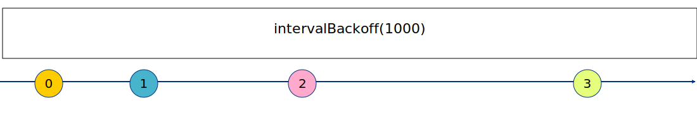

# backoff-rxjs

A collection of helpful RxJS operators to deal with backoff strategies (like exponential backoff)
Angular-in-Depth article about this library is at https://indepth.dev/power-of-rxjs-when-using-exponential-backoff/

## intervalBackoff



`intervalBackoff` works similarly to `interval` except that it doubles the delay between emissions every time.

| name   | type                                                                                                                                                                                                                                                           | attribute | description                                                                                                                                               |
|--------|----------------------------------------------------------------------------------------------------------------------------------------------------------------------------------------------------------------------------------------------------------------|-----------|-----------------------------------------------------------------------------------------------------------------------------------------------------------|
| config | [number](https://developer.mozilla.org/en-US/docs/Web/JavaScript/Reference/Global_Objects/Number) \  [IntervalBackoffConfig](https://github.com/alex-okrushko/backoff-rxjs/blob/bddb11d6d06d2d2ccdeb12e3c779bc3ae03311db/src/observable/intervalBackoff.ts#L6) | required  | Can take number as initial interval or a config with initial interval, optional max Interval and optional backoff delay function (exponential by default) |

`interval` is especially useful for periodic polls that are reset whenever user activity is detected:

```ts
fromEvent(document, 'mousemove').pipe(
  // There could be many mousemoves, we'd want to sample only
  // with certain frequency
  sampleTime(LOAD_INTERVAL_MS),

  // Start immediately
  startWith(null),

  // Resetting exponential interval
  switchMapTo(
    intervalBackoff({
      initialInterval: LOAD_INTERVAL_MS,
      maxInterval: MAX_INTERVAL_MS
    })
  )
);
```

## retryBackoff


| name   | type                                                                                                                                                                                                                  | attribute | description                                                                                                                                                                                                                          |
|--------|-----------------------------------------------------------------------------------------------------------------------------------------------------------------------------------------------------------------------|-----------|--------------------------------------------------------------------------------------------------------------------------------------------------------------------------------------------------------------------------------------|
| config | [number](https://developer.mozilla.org/en-US/docs/Web/JavaScript/Reference/Global_Objects/Number) \  [RetryBackoffConfig](https://github.com/alex-okrushko/backoff-rxjs/blob/master/src/operators/retryBackoff.ts#L6) | required  | Can take number as initial interval or a config with initial interval, optional max Interval, optional max number of retry attempts, optional function to cancel reties and optional backoff delay function (exponential by default) |

```ts
 this.service.callBackend().pipe(
   retryBackoff({
     initialInterval: 100,
     maxRetries: 12,
     // 👇 resets retries count and delays between them to init values
     resetOnSuccess: true
    })
 )
```
